# Hi there, I'm Ravali Meka 👋

## DevOps Engineer

I'm a DevOps Engineer focused on building reliable, automated, and scalable infrastructure. I enjoy streamlining deployment pipelines, containerizing applications, and driving automation across the software delivery lifecycle.

### 🛠️ Skills

- **Containerization & Orchestration:** Docker, Kubernetes
- **Infrastructure as Code:** Terraform
- **CI/CD & Automation:** CI/CD Pipelines, Automation Scripting
- **Scripting & Programming:** Shell, Python

### 🌱 What I Do

- Design and maintain CI/CD pipelines for smooth and reliable deployments
- Manage containerized applications with Docker and Kubernetes
- Automate infrastructure provisioning using Terraform
- Write Shell and Python scripts to streamline operations and reduce manual effort
- Continuously improve deployment reliability and automation

### 📊 GitHub Contribution Observatory

### 🎯 Learning Roadmap

- [x] Docker & Kubernetes basics
- [x] CI/CD with Jenkins
- [ ] Ansible automation
- [ ] Helm charts
- [ ] Advanced Shell Scripting
- [ ] Kubernetes certification (CKA)

### 📫 Let's Connect

Feel free to explore my repositories and reach out if you'd like to collaborate!
