<picture><source media="(prefers-color-scheme: dark)" srcset="./banner.svg"></picture>

## GitHub stats

<picture><source media="(prefers-color-scheme: dark)" srcset="./cards/stats.svg"></picture>
<picture><source media="(prefers-color-scheme: dark)" srcset="./cards/streak.svg"></picture>
<picture><source media="(prefers-color-scheme: dark)" srcset="./cards/activity.svg"></picture>
<picture><source media="(prefers-color-scheme: dark)" srcset="./cards/universe.svg"></picture>

## Stack

<picture><source media="(prefers-color-scheme: dark)" srcset="./cards/languages.svg"></picture>

## Timeline

<picture><source media="(prefers-color-scheme: dark)" srcset="./cards/timeline.svg"></picture>

## Projects

<a href="https://github.com/RavaliMeka/RavaliMeka"><picture><source media="(prefers-color-scheme: dark)" srcset="./cards/project-1.svg"></picture></a>

## Recently pushed

<picture><source media="(prefers-color-scheme: dark)" srcset="./cards/recent.svg"></picture>

## Connect

<a href="https://github.com/RavaliMeka"><picture><source media="(prefers-color-scheme: dark)" srcset="./cards/connect-github.svg"></picture></a>

<picture><source media="(prefers-color-scheme: dark)" srcset="./cards/footer.svg"></picture>

Patched together from public GitHub data · made with <a href="https://sandeepkomal.github.io/README-Glassfolio/">Patch your profile</a>

