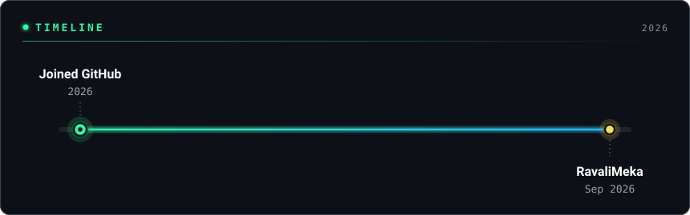
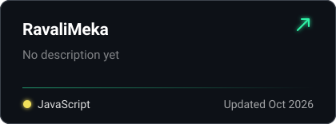

## GitHub stats

## Timeline

## Projects

## Recently pushed

## Connect

---
Patched together from public GitHub data · made with <a href="https://sandeepkomal.github.io/README-Glassfolio/">Patch your profile</a>
